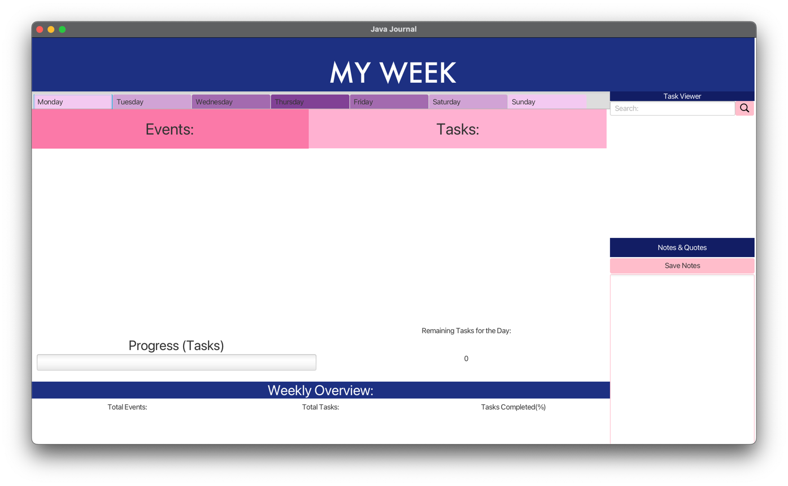

# 3500 PA05 Project Repo

[PA Write Up](https://markefontenot.notion.site/PA-05-8263d28a81a7473d8372c6579abd6481)

## HOW TO RUN:
- Right-click on the JavaJournal.jar file (through intelliJ) and click "Run JavaJournal.jar"
- Or double-click the file (JavaJournal.jar) on your system
- or run the following command in the terminal: `java -jar JavaJournal.jar`
- or run it using the run configuration in intelliJ: JavaJournal.jar
- [Link to the Jar file](JavaJournal.jar):

Introducing the Ultimate Bullet Journal: Your Personal Organizer and Creative Companion!

Welcome to the digital era of bullet journaling with our innovative app designed to revolutionize the way you plan, organize, and express yourself. Whether you're a seasoned bullet journal enthusiast or new to the concept, our app is here to simplify your life and ignite your creativity.

## Key Features:
- Week View : View your week at a glance with our intuitive week interface.
- Event and Task Creation : Create events and tasks with ease and customize them to your liking.
- Commitment Warnings : Receive warnings when you are over-committing yourself.
- Persistence : Your data is saved and will be there when you return.

## Headlining Features
- Menu Bar & Shortcuts: Navigate the app with ease using our menu bar and keyboard shortcuts.
- Task Queue : Create a queue of tasks to be completed throughout the week and view them all in one place.

## Power Ups
- Quotes and Notes : Jot down your thoughts in our notes and quotes section.
- Weekly Overview : Get a bird's eye view of your week with our weekly overview.
- Progress Bar : Track your progress with our progress bar for every single day of the week.

## Quality of Life
- Links : Add links to your events and tasks to easily access them.
- Task Search : Search for tasks by name.

## Extras
- Splash Screen : Enjoy our splash screen while the app loads.
- Visual Flourish : Enjoy our beautiful and intuitive user interface.
- Privacy Lock : Set a password to protect your data. 
- Weekly Starters : Choose from a variety of weekly starter templates to get you started.
- Deployable App : Download our app and use it on your desktop.

- At least one screenshot showcasing your GUI and its features; : 
- A descriptive example of how you applied each SOLID principle to your project (1 short paragraph per principle);

### Single Responsibility Principle:  
- In our development process, we adhered to the principle of single responsibility by breaking down complex methods into smaller, more focused helpers. By doing so, each helper method was responsible for performing a specific task, making the code more readable, maintainable, and easier to test. Furthermore, we extended this principle to the design of our classes, ensuring that each class had a single responsibility. For instance, in the model used for data definition, each class was dedicated to representing a specific entity or concept within our system. This approach not only improved the modularity of our codebase but also enhanced our ability to make isolated changes and understand the purpose and functionality of each component with clarity.
### Open/Close Principle:  
- We followed the open/closed principle in our development process by designing our codebase for easy extension without modification. To achieve this, we used interfaces as contracts for common behaviors. By programming to interfaces rather than specific implementations, we ensured loose coupling and flexibility. When introducing new entities, we implemented the data model interface, providing entity-specific details. This approach allowed us to extend our system's functionality seamlessly without modifying existing code. By leveraging interfaces, we achieved a modular and extensible codebase, promoting code reuse, simplified testing, and improved maintainability.
### Liskov Substitution Principle:
- Although right now we have a week class that has all the fields for the week, we can extend the week class to a new class called theme or category. The theme or category class can be implemented to add the theme or category specific details. This approach would allow us to achieve a modular and extensible codebase, promoting code reuse, simplified testing, and improved maintainability. Basically, we can alwyas replace the week object with its subclasses without breaking the code.
### Interface Segregation Principle:
- We followed the interface segregation principle in our development process by designing our codebase to be composed of main interfaces. By doing so, we ensured that each interface was cohesive and focused on a specific set of behaviors. This approach allowed us to achieve a modular and extensible codebase, promoting code reuse, simplified testing, and improved maintainability. Additionaly, since everything is organized in the MVC model, we can easily add new features and interfaces without breaking the code.
### Dependency Inversion Principle:
- We followed the dependency inversion principle in our development process by designing our codebase to be composed of loosely coupled components. By doing so, we ensured that each component was independent of other components, allowing us to make isolated changes without affecting the rest of the system. This approach allowed us to achieve a modular and extensible codebase, promoting code reuse, simplified testing, and improved maintainability. Additionaly, since everything is organized in the MVC model, we can easily add new features and interfaces without breaking the code.

## How can we extend our program to add a non-implemented feature?
- We can extend our program to add a non-implemented feature by leveraging the open/closed principle. To do so, we would create an interface that defines the behavior of the feature. Then, we would implement the interface in a new class that provides the feature-specific details. By doing so, we would be able to extend our system's functionality without modifying existing code. This approach would allow us to achieve a modular and extensible codebase, promoting code reuse, simplified testing, and improved maintainability.
- For instance, to implement themes or categories, the week class can be extended and the additional fields can be added to the week class. The week class can be extended to a new class called theme or category. The theme or category class can be implemented to add the theme or category specific details. This approach would allow us to achieve a modular and extensible codebase, promoting code reuse, simplified testing, and improved maintainability.
- Another examples could be allowing the user to edit tasks or events, which would require a new class to be implemented to allow the user to edit the task or event. 

### Attribution for any images utilized in your program.
- Splash Screen Background:  
- pinterest.com
- Search Icon: 
- icon8.com